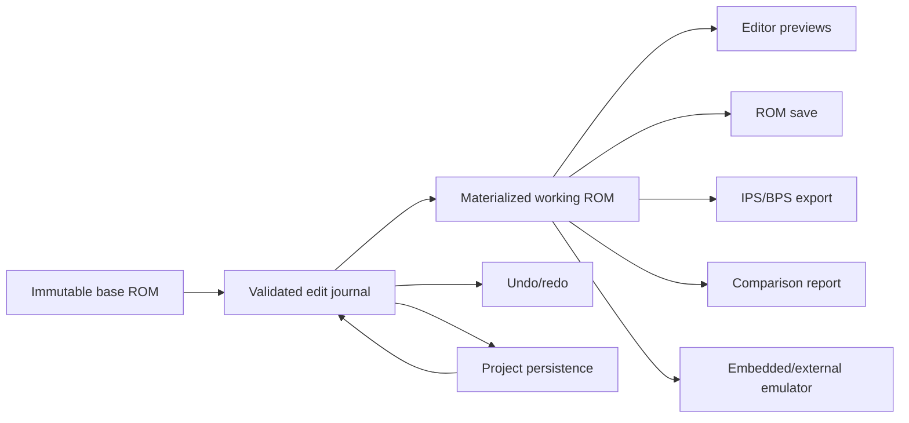

# Project Remediation and Modernization Plan

**Project:** Super Punch-Out!! Editor

**Prepared:** 2026-08-18

**Status:** Authoritative implementation roadmap
**Scope:** All confirmed audit defects, inherited technical-debt work, architectural improvements, security hardening, testing, packaging, and release readiness

## 1. Purpose

This document is the execution plan for taking the current repository from a broad but unreliable prototype to a maintainable, testable, and releasable desktop ROM editor.

It consolidates and supersedes the forward-looking status claims in:

- `TECHNICAL_DEBT_AUDIT.md`
- `TECHNICAL_DEBT_REMEDIATION_PLAN.md`
- `PROJECT_COMPLETION_PLAN.md`

Those documents remain useful historical context and are preserved in `docs/archive/legacy-project-documentation-2026-08-18.zip`, but several of their completed items have regressed or were never complete in the behavior visible today. No item is considered complete in this plan merely because an older document says it is complete. Every phase below has an evidence-based exit gate.

This plan covers two different kinds of work:

1. **Remediation:** repair confirmed build, correctness, persistence, command-registration, security, and repository-health defects.
2. **Modernization:** establish an architecture and delivery process that make those defects less likely to recur.

## 2. Desired End State

At the end of this plan, the project should have the following properties:

1. A clean checkout builds and tests reproducibly on supported platforms.
2. The product exposes only features that are either stable or clearly labeled experimental.
3. Every user edit is represented by one canonical edit operation and flows through the same validation, preview, undo, save, project, patch, comparison, and emulator paths.
4. The original ROM is immutable in memory; the working ROM is a deterministic materialization of the base ROM plus an edit journal.
5. Saving a ROM, exporting IPS/BPS, reopening a project, comparing changes, and launching the emulator all operate on the same edited image.
6. Frontend and backend command contracts are mechanically checked.
7. Project files are portable, versioned, migratable, and contain enough information to restore the editing session.
8. Dangerous functionality, especially plugins and filesystem operations, is explicitly permissioned and constrained.
9. Unsupported research-dependent functionality fails honestly and is not presented as complete.
10. Release artifacts are versioned, signed, documented, and validated on clean machines.

## 3. Planning Rules

The implementation must follow these rules throughout all phases:

1. Correctness comes before feature expansion.
2. No phase may hide a failing check by weakening the check without a written architecture decision.
3. A user-visible success response must mean the operation was durably represented in the working state.
4. Unsupported operations must return explicit errors and must not set the dirty flag.
5. New commands require backend tests, frontend contract coverage, and registration in the same change.
6. No new feature may introduce a second representation of ROM edits.
7. Migration paths must be provided before changing persistent formats used by released builds.
8. Real copyrighted ROM data must not be committed. Tests must use synthetic fixtures or user-supplied local ROMs.
9. Generated outputs, caches, lockfile churn, and build artifacts must not obscure source changes.
10. Each phase should be delivered in reviewable pull requests rather than a single repository-wide rewrite.

## 4. Current Confirmed Baseline

### 4.1 Build and quality baseline

- `cargo check --workspace` fails in the Tauri crate.
- The desktop backend has three borrow-checker failures in `audio_commands.rs`.
- `commands/plugins.rs` uses `AppHandle::state` without importing the required trait.
- `cargo test --workspace --exclude tauri-appsuper-punch-out-editor` fails because `asset-core` tests use `tempfile` without declaring it.
- `cargo fmt --all -- --check` fails across many files.
- `cargo clippy --workspace --all-targets -- -D warnings` fails.
- The frontend builds and its current 14 tests pass after dependencies are installed.
- The repository does not track the frontend lockfile required by `npm ci`.

### 4.2 Runtime correctness baseline

- Forty-six literal frontend `invoke()` command names are not present in the Tauri handler.
- Animation, frame, hitbox, and hurtbox mutations can return success while `AnimationWriter::update_animation` writes nothing.
- Some editing commands mutate `rom.data` directly while others add entries to `pending_writes`.
- Patch export treats the already-mutated `rom.data` as the original baseline, so direct edits can disappear from patches.
- Project save records edit metadata but not sufficient payload data to reconstruct pending edits.
- Project load does not restore the editing journal or pending writes.
- Range calculations in save and patch paths can underflow when an offset is outside the ROM.

### 4.3 Plugin baseline

- `LuaPlugin::from_file` returns placeholder metadata with the ID `loading`.
- Parsed worker metadata is never synchronized back to the manager.
- Multiple plugins therefore collide under the same ID.
- Plugin files are executed while being discovered, before their saved enablement state is evaluated.
- The current Lua runtime includes OS and I/O facilities and is not a security sandbox.

### 4.4 Repository baseline

- Rust and npm lockfiles are ignored even though this is an application repository.
- Approximately 2,433 tracked files under `target2` and `target3` consume about 837 MB.
- Tracked build artifacts account for approximately 99% of the checked-out file size.
- Three crate directories are not workspace members: `assembly-core`, `console-dev-core`, and `profiler-core`.
- The installable legacy Python package, CLI, packaging metadata, test, and tracked bytecode have been removed in the current worktree. The remaining Python files are standalone standard-library research/build utilities.

### 4.5 Documentation baseline

- Existing plans contain stale completion claims.
- Some source and plan files contain developer-machine-specific paths.
- The README describes several workflows more strongly than current behavior supports.
- Product version values are spread across Cargo, Tauri, frontend, updater, and project metadata.

## 5. Target Architecture

The implementation should converge on the following state flow:



### 5.1 Core domain concepts

The exact names may change, but the design should contain these concepts:

- `BaseRom`: immutable bytes, detected region, source hash, source path metadata.
- `EditOperation`: a typed, validated description of one logical change.
- `EditTransaction`: one or more operations that must apply atomically.
- `EditJournal`: ordered transactions, current revision, undo/redo cursor, dirty state.
- `WorkingRom`: deterministic base-plus-journal materialization.
- `ProjectDocument`: versioned serialization of source identity, journal, metadata, and optional embedded assets.
- `RomService`: the only component allowed to load, materialize, validate, save, or export ROM images.
- `CommandFacade`: thin Tauri commands that validate IPC input and delegate to domain services.

### 5.2 State ownership rule

The backend owns authoritative ROM and edit state. The frontend owns presentation state and caches backend projections tagged with a backend revision. The frontend must not maintain an independent list of edits that can diverge from the backend.

## 6. Phase Overview

| Phase | Name | Primary outcome | Dependency | Relative size |
| --- | --- | --- | --- | --- |
| 0 | Scope and baseline lock | One trusted backlog and honest product surface | None | M |
| 1 | Build, CI, and repository recovery | Clean reproducible build and useful signal | Phase 0 | M |
| 2 | IPC command contract | Frontend and backend command surfaces agree | Phase 1 | M |
| 3 | Canonical edit engine | One model for every modification | Phases 1-2 | XL |
| 4 | Unified save, patch, comparison, and emulator pipeline | All outputs use the same working image | Phase 3 | L |
| 5 | Project format v2 and migration | Projects restore complete sessions | Phases 3-4 | L |
| 6 | Frontend state consolidation | One frontend ownership model | Phases 2-5 | L |
| 7 | Feature maturity reconciliation | Stable features work; incomplete features are gated | Phases 2-6 | XL |
| 8 | Security hardening | Restricted IPC, filesystem, updater, and plugin boundaries | Phases 2-7 | L |
| 9 | Test architecture and quality gates | Defects are caught before merge | All prior phases incrementally | XL |
| 10 | Safe-save, recovery, and UX reliability | Users can inspect and recover from risky operations | Phases 3-6 | L |
| 11 | Packaging, versioning, and release engineering | Repeatable signed releases | Phases 1, 5, 8-10 | L |
| 12 | Documentation and release certification | Evidence-backed release readiness | All phases | M |

## 7. Phase 0 — Scope and Baseline Lock

### 7.1 Goal

Stop implementing against contradictory plans and stop presenting incomplete functionality as stable.

### 7.2 Tasks

#### Governance

1. Adopt this document as the forward roadmap.
2. Add a historical-status banner to the older three plan documents.
3. Create a short architecture decision record stating that completion claims require current automated or manual evidence.
4. Define status labels: `stable`, `experimental`, `research-blocked`, `deprecated`, and `removed`.

#### Product-surface inventory

1. Enumerate every top-level tab, menu command, toolbar action, settings panel, and context-menu action.
2. For each surface, record:
   - frontend entry point;
   - backend commands used;
   - persistent data touched;
   - current tests;
   - status label;
   - release decision.
3. Mark animation write-back, advanced audio editing, layout packs, plugins, help, detailed reports, and developer tooling explicitly.
4. Hide `research-blocked` and `deprecated` functionality in production builds unless the user enables an experimental mode.
5. Rewrite README workflow claims to match the inventory.

#### Legacy cleanup confirmation

1. Commit the removal of the obsolete Python package as a focused change.
2. Keep standalone Python research/build utilities only where they still have a documented purpose.
3. Add `__pycache__/`, `*.pyc`, `.pytest_cache/`, and `.venv/` to ignore rules.

### 7.3 Deliverables

- Product-surface inventory document.
- Architecture decision record for roadmap authority and completion evidence.
- Updated README feature matrix.
- Focused commit removing the legacy Python package.

### 7.4 Exit criteria

- Every visible feature has an owner and maturity label.
- No old plan is treated as the current status source.
- No user-facing control promises an operation that only returns a placeholder or successful no-op.
- The legacy Python package is absent and has no remaining import references.

## 8. Phase 1 — Build, CI, and Repository Recovery

### 8.1 Goal

Make the repository inexpensive to clone and ensure every subsequent phase starts from trustworthy automated checks.

### 8.2 Build repairs

1. Fix nested lock lifetimes in `audio_commands.rs` by cloning the imported sample into a local before the outer audio guard is dropped.
2. Apply the same fix to preview, WAV export, and BRR export paths.
3. Import `tauri::Manager` in `commands/plugins.rs`, or refactor the batch worker to receive a safe state handle without repeated global lookup.
4. Add `tempfile = { workspace = true }` under `asset-core` dev dependencies.
5. Run `cargo check --workspace` and fix every compiler error without adding broad `allow` attributes.
6. Run workspace tests and fix missing test-only dependencies.
7. Run rustfmt over the workspace and commit formatting separately from logic when practical.
8. Triage Clippy failures:
   - fix correctness and suspicious-code lints first;
   - fix mechanical style lints second;
   - document any narrowly scoped, justified allow attributes.

### 8.3 Dependency reproducibility

1. Stop ignoring `Cargo.lock` and `apps/desktop/package-lock.json`.
2. Generate both lockfiles from supported toolchain versions.
3. Commit the lockfiles.
4. Pin the Rust toolchain using `rust-toolchain.toml` or document an explicit minimum and tested stable version.
5. Add Node and npm engine constraints to the frontend package metadata.
6. Validate a clean install with `npm ci`, not `npm install`.
7. Add a CI check that fails if a manifest changes without the corresponding lockfile.

### 8.4 Repository artifact cleanup

1. Remove tracked `target2`, `target3`, `.pyc`, and other generated files from the Git index.
2. Expand ignore rules to cover nested and numbered target directories.
3. Measure the post-cleanup checkout size and record it in the pull request.
4. Decide separately whether Git history rewriting is worth the disruption:
   - do not rewrite history in the normal cleanup PR;
   - if clone size remains excessive, prepare a separate coordinated history-cleaning procedure.
5. Confirm no ROM, patch, save-state, emulator binary, or copyrighted asset is tracked accidentally.

### 8.5 Workspace membership decision

For `assembly-core`, `console-dev-core`, and `profiler-core`, choose one outcome per crate:

1. Add it to the workspace and make it pass checks.
2. Move it under an explicitly experimental directory and exclude it from release claims.
3. Archive/remove it if it has no supported consumer.

The repository must not imply that uncompiled crates are production components.

### 8.6 CI structure

1. Add fast jobs for formatting, metadata, frontend type checking, and command-contract validation.
2. Keep full Rust tests and Clippy as required jobs.
3. Add at least one Tauri backend test job using the mock runtime where native WebView startup is unnecessary.
4. Retain platform matrix compilation for Windows, macOS, and Linux.
5. Cache by committed lockfile hashes.
6. Add dependency auditing for Rust and npm dependencies.
7. Publish logs or test reports when a matrix job fails.

### 8.7 Exit criteria

- Clean checkout succeeds with the documented install commands.
- `cargo fmt --all -- --check` passes.
- `cargo check --workspace` passes.
- `cargo clippy --workspace --all-targets -- -D warnings` passes or uses only reviewed narrow exceptions.
- `cargo test --workspace` passes under the agreed platform constraints.
- `npm ci`, type checking, production build, and frontend tests pass.
- CI uses committed lockfiles.
- Generated files no longer dominate repository size.

## 9. Phase 2 — IPC Command Contract

### 9.1 Goal

Make it impossible to merge a frontend command call that is absent, misspelled, incorrectly registered, or structurally incompatible with the backend.

### 9.2 Immediate command reconciliation

Produce a generated inventory and make an explicit decision for each of the 46 currently unregistered frontend commands:

```text
add_attack_pattern
add_frame_annotation
add_sprite_to_frame
apply_layout_pack
can_redo
can_undo
capture_project_thumbnail
clear_project_thumbnail
delete_layout_pack
duplicate_sprite
export_animation_to_json
export_detailed_asset_report
export_layout_pack
generate_detailed_asset_report
get_all_scripts
get_animation_categories
get_available_layout_packs
get_fighter_animations
get_fighter_header
get_frame_annotations
get_patch_notes_data
get_project_thumbnail
get_redo_stack
get_scripts_for_fighter
get_undo_stack
import_layout_pack
install_layout_pack
launch_external_emulator
load_boxer_animation
load_project_thumbnail_from_path
move_sprite
preview_animation_frame
record_asset_import
record_palette_edit
record_sprite_bin_edit
remove_attack_pattern
remove_frame_annotation
remove_sprite
render_comparison_view
render_frame_data_preview
save_frame
save_project_thumbnail
update_fighter_params
update_sprite_flags
validate_fighter_params
validate_layout_pack
```

For each command, choose one of:

- register and support it;
- rename the frontend call to an existing canonical command;
- remove the unused UI path;
- gate it behind experimental mode;
- delete obsolete backend/frontend code.

### 9.3 Contract design

1. Centralize command names rather than scattering raw strings across components.
2. Define serializable request and response types for every non-trivial command.
3. Generate or mechanically validate TypeScript types from Rust command DTOs.
4. Use consistent field naming and error envelopes.
5. Standardize errors into categories such as validation, no-ROM-loaded, unsupported, I/O, conflict, and internal.
6. Include the backend revision in responses that mutate or project edit state.
7. Avoid returning unstructured JSON where a stable DTO is feasible.

### 9.4 Automated checks

1. Extract literal frontend invokes during CI.
2. Extract registered commands from the Tauri handler or a central command registry.
3. Fail CI when a literal invoke has no registered command.
4. Report registered commands with no known frontend or test consumer for review, but allow an explicit backend-only annotation.
5. Add mocked IPC tests for representative success and failure cases.
6. Add a smoke test that constructs the Tauri app and verifies command registration without starting a production window.

### 9.5 Exit criteria

- Zero unintended frontend invokes are missing from the handler.
- Every intentional backend-only command is documented.
- Command request and response types have a single source of truth or a validated mapping.
- Renaming a command without updating its consumer fails CI.
- Unsupported commands are not exposed as successful user actions.

## 10. Phase 3 — Canonical Edit Engine

### 10.1 Goal

Replace the split direct-mutation and `pending_writes` architecture with one deterministic edit journal.

### 10.2 Domain design

Create a dedicated domain module or crate with no Tauri or React dependencies.

Suggested core types:

```rust
struct BaseRom {
    bytes: Arc<[u8]>,
    sha1: String,
    region: RomRegion,
}

enum EditOperation {
    WriteBytes { offset: usize, before: Vec<u8>, after: Vec<u8> },
    RenameBoxer { fighter_id: u8, before: String, after: String },
    ReplacePalette { asset_id: String, before: Vec<u8>, after: Vec<u8> },
    ReplaceAsset { asset_id: String, before: Vec<u8>, after: Vec<u8> },
    // Add typed variants only when they add meaningful validation or metadata.
}

struct EditTransaction {
    id: Uuid,
    label: String,
    operations: Vec<EditOperation>,
    timestamp: DateTime<Utc>,
}
```

The specific serialization format and identifier type should be decided in an architecture decision record.

### 10.3 Required behavior

1. Validate all ranges with checked arithmetic before applying an operation.
2. Capture before-bytes from the current revision, not from a stale frontend value.
3. Apply multi-operation transactions atomically.
4. Reject conflicting overlapping operations unless their ordering is explicit.
5. Derive dirty state from journal revision rather than manually toggling booleans.
6. Undo by reversing the last committed transaction.
7. Redo by replaying the next transaction.
8. Clear redo history whenever a new operation is committed after an undo.
9. Provide deterministic materialization of the current ROM.
10. Expose a compact change summary without requiring the frontend to interpret bytes.

### 10.4 Migration strategy

Do not rewrite all commands at once. Migrate by vertical slices:

1. Palette edits.
2. Sprite/portrait imports.
3. Roster names, circuits, unlock order, and intro text.
4. AI behavior edits.
5. Relocation and bank duplication.
6. Animation edits after write-back is truly implemented.
7. Audio edits that are actually supported.

For each slice:

1. Add a typed operation or validated byte-write transaction.
2. Route preview through the materialized image.
3. Route undo/redo through the journal.
4. Remove the old direct mutation or pending-write path.
5. Add round-trip and overlap tests.

### 10.5 AppState changes

1. Replace mutable `Option<Rom>` plus separate pending writes with a session object containing `BaseRom`, `EditJournal`, and cached materialization.
2. Keep the source path and save path distinct.
3. Track a monotonically increasing session revision.
4. Invalidate caches only when the revision changes.
5. Ensure plugins, project state, emulator state, and comparison commands receive read-only projections or controlled service APIs.

### 10.6 Exit criteria

- No supported editing command mutates ROM bytes outside the edit service.
- `pending_writes` is removed or becomes a temporary compatibility adapter with no independent state.
- Dirty state, undo, redo, project persistence, save, patch, and comparison all derive from the journal.
- Two identical base ROMs plus identical journals materialize identical bytes.
- Invalid or overlapping edits fail without partially changing state.

## 11. Phase 4 — Unified Output Pipeline

### 11.1 Goal

Ensure every output consumer receives the same validated current image.

### 11.2 One materialization API

Introduce one backend method similar to:

```rust
fn materialize_current_rom(&self) -> Result<MaterializedRom, RomSessionError>;
```

The result should include:

- final bytes;
- base SHA-1;
- current SHA-1;
- revision;
- region;
- validated change ranges;
- warnings that do not block output.

### 11.3 ROM saving

1. Validate every edit before touching the destination.
2. Write to a temporary file in the destination filesystem.
3. Flush and close the temporary file.
4. Reopen and verify length and hash.
5. Optionally create a timestamped backup when overwriting an existing file.
6. Atomically replace the destination where the platform permits.
7. Preserve the base ROM and journal after Save As unless the user explicitly starts a new baseline.
8. Report the saved revision so the frontend can clear the correct dirty marker.

### 11.4 Patch export

1. Generate IPS/BPS from immutable base bytes to materialized current bytes.
2. Reject unsupported expansions that the chosen patch format cannot represent safely.
3. Include project metadata in BPS metadata where appropriate.
4. Verify the generated patch by applying it to the base bytes in memory.
5. Confirm the patched result hash equals the materialized current hash.
6. Report logical transaction count and changed-byte count separately.

### 11.5 Comparison and reports

1. Compare immutable base to materialized current bytes.
2. Produce logical summaries from edit metadata and binary summaries from byte differences.
3. Ensure detailed reports, preview canvases, and patch notes use the same revision.
4. Label reports with base and current hashes.

### 11.6 Emulator integration

1. Load the materialized current image, never a separate reconstruction path.
2. Tag emulator sessions with the editor revision they loaded.
3. Show when the editor has newer changes than the running emulator.
4. Reload safely or ask the user before destroying emulator runtime state.

### 11.7 Bounds and validation hardening

1. Replace all `len - offset` calculations with checked range helpers.
2. Centralize `validate_range(offset, length, rom_len)`.
3. Reject out-of-range writes; never silently truncate an edit unless truncation is the documented operation.
4. Add boundary tests for zero-length ROMs, exact-end writes, one-byte overflow, large lengths, and arithmetic overflow.

### 11.8 Exit criteria

- Save, patch, comparison, reports, and emulator use the same revision and hash.
- A boxer-name-only edit appears in both IPS and BPS output.
- Applying an exported patch reproduces the saved working ROM exactly.
- Invalid ranges produce errors rather than panics or silent truncation.
- Interrupted saves do not corrupt the previous destination file.

## 12. Phase 5 — Project Format v2 and Migration

### 12.1 Goal

Make projects complete, portable, recoverable editing sessions rather than metadata-only summaries.

### 12.2 Format requirements

Project format v2 must store:

- schema version;
- application version that last wrote the project;
- base ROM SHA-1, size, region, and optional display filename;
- complete serialized edit journal;
- original and replacement bytes where needed for validation and undo;
- logical edit metadata;
- project settings that affect materialization;
- duplicated/relocated bank metadata;
- references to imported assets;
- optional embedded copies of imported assets;
- optional thumbnail;
- last saved revision;
- integrity hash for the project document or bundle manifest.

It must not embed the copyrighted base ROM.

### 12.3 Storage decision

Choose and document one format:

1. Directory project with a JSON manifest and asset files.
2. Single portable archive containing the same structure.
3. Directory during editing plus explicit portable export.

The recommended approach is a directory project for resilience and debuggability, with a separate portable archive export.

### 12.4 Save behavior

1. Snapshot the journal at a specific revision.
2. Serialize to a temporary manifest.
3. Verify referenced assets exist and match hashes.
4. Atomically replace the previous manifest.
5. Retain the previous valid manifest as a recovery file until the new write verifies.
6. Never mark the project clean if the saved revision differs from the current revision.

### 12.5 Load behavior

1. Parse and validate the schema before mutating app state.
2. Require a loaded ROM or guide the user to select one.
3. Validate base hash, size, and region.
4. Validate every journal operation against the base and prior operations.
5. Materialize in scratch memory.
6. Verify the expected current hash if stored.
7. Swap the session into AppState only after all validation succeeds.
8. Preserve the existing session if load fails.

### 12.6 Migration

1. Implement a read-only v1 parser.
2. Detect whether a v1 project actually contains enough payload to migrate.
3. For metadata-only v1 projects:
   - explain that edits cannot be reconstructed;
   - offer metadata import rather than pretending restoration succeeded.
4. Write v2 only after explicit migration confirmation.
5. Keep migration fixtures for every released schema version.

### 12.7 Autosave and recovery

1. Autosave the project journal, not the ROM, at controlled revision intervals.
2. Store recovery files in app data, not alongside arbitrary ROM paths by default.
3. Detect recovery state after a crash.
4. Show base hash, project name, timestamp, and operation count before restoring.
5. Allow discard without deleting the user's last explicit project save.

### 12.8 Exit criteria

- Saving, restarting, loading the same base ROM, and opening the project restores an identical working-ROM hash.
- Undo/redo history survives project reload if that is the documented behavior.
- Invalid projects never partially replace the active session.
- Older supported project versions have tested migration behavior.
- Projects never include the base ROM bytes.

## 13. Phase 6 — Frontend State Consolidation

### 13.1 Goal

Give each state field one owner and make backend revision changes explicit.

### 13.2 Store architecture

1. Inventory `useStore`, specialized Zustand stores, component-local caches, and persisted browser storage.
2. Classify each field as:
   - backend authority projection;
   - frontend domain selection;
   - transient component state;
   - user preference;
   - derived value.
3. Choose one authoritative frontend store layout.
4. Prefer domain slices within one store if independent stores cannot guarantee coordinated reset.
5. Remove duplicate action implementations and deprecated exports.
6. Persist preferences only; do not persist stale ROM-derived objects in browser storage.

### 13.3 ROM session state machine

Model ROM lifecycle explicitly:

```text
empty -> opening -> ready -> saving
                 -> error
ready -> closing -> empty
ready -> opening another ROM
```

1. Reset all ROM-bound projections on session replacement.
2. Cancel or ignore stale async responses using session IDs or revisions.
3. Prevent commands that require a ROM while the session is empty or changing.
4. Ensure USA, JPN, and PAL sequential loads cannot leak selections or offsets.

### 13.4 Edit synchronization

1. Receive the authoritative revision and dirty state from mutation responses.
2. Refresh undo/redo availability after journal changes without polling.
3. Do not maintain a frontend `Set` of pending offsets as an independent authority.
4. Invalidate feature caches by revision.
5. Use selectors to limit large component rerenders.

### 13.5 Error and progress model

1. Standardize loading, empty, unsupported, validation-error, and fatal-error states.
2. Replace swallowed console errors with visible actionable messages where user action failed.
3. Support progress and cancellation for genuinely cancellable long tasks.
4. Avoid presenting a cancel button that only hides progress.

### 13.6 Exit criteria

- One frontend action path exists for ROM load, save, project load, and each edit type.
- Sequential ROM loads do not expose stale data.
- No frontend state claims an edit exists after the backend rejected it.
- Undo/redo, dirty markers, previews, and emulator revision indicators update deterministically.
- Store tests cover lifecycle transitions and stale-response rejection.

## 14. Phase 7 — Feature Maturity Reconciliation

### 14.1 Goal

Finish or remove every feature exposed by the product inventory.

### 14.2 Animation editor

Choose one release path:

1. **Implement:** fully reverse-engineer and implement frame sequence, pose, hitbox, and hurtbox write-back with round-trip tests.
2. **Read-only:** retain playback and inspection while disabling mutation controls.
3. **Experimental:** keep mutation controls only behind a clearly labeled developer flag and return explicit unsupported errors for unimplemented writes.

Do not retain the current successful no-op behavior under any path.

### 14.3 Layout packs

1. Reconcile and register all layout-pack commands.
2. Validate pack schema version, region, boxer keys, sizes, offsets, and referenced assets.
3. Treat offset mismatches as blocking errors when applying would be unsafe.
4. Prevent filename traversal during install and delete.
5. Store community packs under app data rather than a current-working-directory-relative path.
6. Add import, validate, apply, install, list, and delete integration tests.

### 14.4 Plugins

Functional work must precede broader plugin exposure:

1. Parse plugin metadata synchronously without executing plugin code.
2. Return real metadata from `LuaPlugin::from_file`.
3. Key plugins by validated unique IDs.
4. Default new plugins to disabled.
5. Persist enablement under the real plugin ID.
6. Start the runtime only after explicit enablement.
7. Add startup, enable, disable, reload, command execution, crash, timeout, and duplicate-ID tests.
8. Decide whether plugins remain in stable v1 scope. If not, hide the manager in production builds.

### 14.5 Help system

1. Either register and test help commands or remove the inactive frontend surface.
2. Sanitize any HTML rendered through `dangerouslySetInnerHTML` even when Markdown conversion escapes raw HTML.
3. Package help content as a verified resource.
4. Remove commented-out command registrations after the decision.

### 14.6 Audio

1. Separate proven browse/import/export capabilities from research-blocked sequence or ROM extraction work.
2. Remove or disable controls for unsupported sequence editing and ROM scanning.
3. Make preview/export capability requirements explicit.
4. Add BRR/WAV round-trip, sample-rate, malformed-input, and temporary-file cleanup tests.

### 14.7 Emulator and developer tools

1. Reconcile external-emulator command names and registrations.
2. Validate executable paths and arguments without invoking a shell.
3. Define whether frame reconstruction, script editing, bank visualization, profiler, assembly tools, and console tooling are stable or experimental.
4. Keep developer-only tools out of normal navigation.

### 14.8 Exit criteria

- Every visible control reaches a registered command or a purely frontend operation.
- Every stable editing operation persists through the canonical journal.
- Research-blocked operations are hidden or explicitly disabled.
- Plugins, if shipped, support multiple real plugin IDs and honor disabled state.
- The release feature matrix matches runtime behavior.

## 15. Phase 8 — Security Hardening

### 15.1 Goal

Reduce the impact of compromised frontend content, malicious project/layout files, unsafe paths, plugins, and updater misconfiguration.

### 15.2 WebView and IPC

1. Replace `csp: null` with a restrictive Content Security Policy tailored to local assets and required Tauri IPC endpoints.
2. Avoid remote script and stylesheet loading.
3. Define application command permissions rather than allowing every registered command to every window by default.
4. Group capabilities by use case: core editing, dialogs, updater, external tools, and experimental plugins.
5. Use narrower scopes for filesystem and URL operations.
6. Validate every IPC DTO at the command boundary.

### 15.3 Filesystem safety

1. Canonicalize and validate paths immediately before sensitive operations.
2. Restrict automatic writes to app-owned directories or user-selected targets.
3. Reject traversal components in logical filenames and plugin IDs.
4. Use safe temporary files for exports and saves.
5. Define symlink behavior explicitly.
6. Limit file sizes before loading images, projects, packs, scripts, or ROM-like data into memory.

### 15.4 Plugin trust model

Preferred order of options:

1. Run untrusted plugins in a separate constrained process with a narrow message API.
2. If in-process Lua remains, construct it with an explicit minimal library set that excludes OS, I/O, package loading, debug, and other unnecessary facilities.
3. Add instruction/time and memory limits.
4. Require explicit first-run trust showing plugin ID, hash, requested permissions, and source path.
5. Re-prompt when the plugin file hash changes.
6. Treat native or unrestricted plugins as arbitrary-code execution and label them accordingly.
7. Never execute top-level code merely to read metadata.

### 15.5 Update security

1. Verify that the updater endpoint returns the schema expected by the Tauri updater.
2. Establish an offline-protected signing-key procedure.
3. Validate updater public keys and signatures in a staging release.
4. Test downgrade rejection, invalid signatures, missing assets, and interrupted downloads.
5. Keep manual-download URLs constrained to the official release location.

### 15.6 Supply-chain and disclosure

1. Run Rust and npm dependency audits in CI.
2. Review Tauri permissions whenever plugins or dependencies are added.
3. Generate an SBOM for release artifacts.
4. Add a security policy explaining supported versions and private reporting.
5. Document the plugin trust boundary prominently.

### 15.7 Exit criteria

- CSP is enabled and tested.
- Commands and plugin permissions follow least privilege.
- Malicious filenames, offsets, project documents, and layout packs fail safely.
- Disabled plugins execute no code.
- Untrusted Lua cannot access the OS or filesystem unless the user grants an explicit capability.
- Updater signature verification is tested before release.

## 16. Phase 9 — Test Architecture and Quality Gates

### 16.1 Goal

Create a layered test system that catches contract, persistence, binary-format, and lifecycle regressions.

### 16.2 Test pyramid

#### Domain unit tests

Cover:

- checked range calculations;
- SNES/PC address conversion;
- region detection;
- text encoding and limits;
- palette conversion;
- sprite and portrait codecs;
- compression/decompression round trips;
- BRR/WAV conversion;
- edit application, overlap, undo, and redo;
- project serialization and migration;
- patch generation and verification.

#### Property tests

Add properties such as:

1. Decode(encode(value)) equals the normalized input.
2. Decompress(compress(bytes)) equals bytes.
3. Undo(apply(edit)) restores the prior image.
4. Applying the same journal to the same base is deterministic.
5. Exported patch applied to base equals materialized working bytes.
6. Serialization then deserialization preserves the journal and current hash.

#### Fuzz tests

Fuzz parsers that accept untrusted binary or structured input:

- ROM headers;
- project manifests;
- layout packs;
- compression streams;
- image import metadata;
- patch readers/applicators if present;
- plugin metadata.

The minimum invariant is no panic, uncontrolled allocation, or out-of-bounds access.

#### Backend command tests

1. No-ROM-loaded behavior.
2. Invalid identifiers and offsets.
3. Successful mutation returns the new revision.
4. Unsupported operations do not mark dirty.
5. Project load is transactional.
6. Save and patch operations use the same materialized hash.

#### Frontend tests

1. Mock IPC for every primary workflow.
2. Test loading, empty, validation, unsupported, and fatal errors.
3. Test session replacement and stale async response rejection.
4. Test dirty, undo, redo, and emulator revision states.
5. Test feature flags and maturity labels.

#### End-to-end tests

Use synthetic fixtures for a minimum scenario:

1. Open synthetic ROM.
2. Perform representative roster, palette, and asset edits.
3. Save project.
4. Export patch and ROM.
5. Restart app.
6. Reopen base and project.
7. Verify the working hash and UI projections.

### 16.3 Real-ROM local verification

1. Provide an opt-in local test harness that uses environment-specified user ROM paths.
2. Verify only known hashes and never upload artifacts.
3. Keep results local or emit metadata-only summaries.
4. Use this suite for release candidates, not normal public CI.

### 16.4 CI gates

Required merge checks should include:

- formatting;
- Rust check and tests;
- Clippy;
- frontend clean install, type check, tests, and build;
- IPC command-contract check;
- manifest and project-schema validation;
- dependency audits;
- generated-artifact check;
- at least one save/patch/project integration scenario.

### 16.5 Exit criteria

- Critical binary transformations have round-trip or golden tests.
- Every fixed P1 defect has a regression test.
- Parsers of untrusted data have fuzz coverage or a documented reason not to.
- Core workflow integration tests run in CI without copyrighted assets.
- Test failures identify the affected layer rather than requiring a full desktop debugging session.

## 17. Phase 10 — Safe-Save, Recovery, and UX Reliability

### 17.1 Goal

Make destructive mistakes difficult and recovery straightforward.

### 17.2 Preflight review

Before save or patch export, show:

- source ROM identity and region;
- current revision;
- operation count;
- changed-byte count and ranges;
- expansions or relocations;
- validation warnings;
- destination path;
- whether an existing file will be replaced;
- backup behavior.

### 17.3 Recovery behavior

1. Prompt on close, ROM switch, or project switch when the current revision is not saved.
2. Distinguish project-save state from ROM-export state.
3. Keep recovery journal snapshots after crashes.
4. Offer a clear restore/discard decision on next launch.
5. Never silently overwrite the source ROM by default.

### 17.4 Long-running operations

1. Report real cumulative progress.
2. Support cancellation only where the backend can honor it safely.
3. Keep the previous valid output when cancellation occurs.
4. Prevent duplicate submissions.
5. Make background tasks observable and bounded.

### 17.5 Accessibility and interaction consistency

1. Ensure dialogs trap focus and return focus correctly.
2. Provide keyboard access to core editing workflows.
3. Use consistent confirmation severity and button ordering.
4. Announce errors and progress to assistive technologies.
5. Avoid color-only indicators for dirty, warning, shared-bank, or validation states.

### 17.6 Performance

1. Measure ROM materialization and large asset rendering.
2. Cache by revision where it is safe.
3. Move CPU-heavy image/compression work off the UI thread.
4. Bound preview memory and image dimensions.
5. Define performance budgets for open, save, patch, and project load.

### 17.7 Exit criteria

- Users can inspect exactly what will be written.
- Save failure or cancellation leaves the prior destination intact.
- Unsaved work is not silently lost on close or session replacement.
- Recovery files restore a validated journal.
- Core workflows are keyboard-accessible and expose useful error states.

## 18. Phase 11 — Packaging, Versioning, and Release Engineering

### 18.1 Goal

Produce repeatable, identifiable, and verifiable application releases.

### 18.2 Single-source versioning

1. Choose one authoritative application version.
2. Generate or validate:
   - workspace package version;
   - Tauri bundle version;
   - frontend package version;
   - updater version;
   - release metadata.
3. Keep project schema version independent from application version.
4. Add a CI check that version values agree.

### 18.3 Packaging

1. Verify manifests, documentation, icons, licenses, and optional emulator resources are bundled correctly.
2. Define behavior when the libretro core is absent.
3. Build installers on clean Windows, macOS, and Linux runners.
4. Smoke-test installed applications rather than only development builds.
5. Test app-data paths, project paths, plugin paths, and resource lookup on each platform.

### 18.4 Release process

1. Define alpha, beta, release-candidate, and stable channels.
2. Require the full release verification matrix before a stable tag.
3. Generate changelog and known-limitations sections from reviewed inputs.
4. Sign installers and updater artifacts.
5. Publish checksums and SBOMs.
6. Test update from the previous supported stable release.
7. Document rollback if a release or updater manifest is defective.

### 18.5 Exit criteria

- All version consumers agree.
- Clean platform builds produce installable artifacts.
- Installed smoke tests pass.
- Updater artifacts validate cryptographically.
- A previous supported release can update to the candidate successfully.
- Release documentation states supported and experimental features accurately.

## 19. Phase 12 — Documentation and Release Certification

### 19.1 Goal

Finish with documentation and evidence that correspond to the shipped product.

### 19.2 Documentation set

Update or create:

- README supported workflows and limitations;
- contributor setup and verification guide;
- architecture overview;
- edit-journal architecture decision record;
- project format specification and migration guide;
- plugin trust and permission model;
- release procedure;
- troubleshooting guide;
- security policy;
- user guide for backup, project recovery, patch export, and emulator testing.

### 19.3 Stale documentation cleanup

1. Remove machine-specific absolute paths.
2. Mark superseded plans as historical.
3. Delete misleading implementation summaries.
4. Ensure commands and screenshots match the current UI.
5. Validate internal Markdown links in CI.

### 19.4 Final certification matrix

Run and record evidence for:

1. Clean clone and dependency installation.
2. Formatting, Clippy, backend tests, frontend tests, and production builds.
3. USA, JPN, and PAL load transitions where supported.
4. Roster, palette, sprite/portrait, and supported text edits.
5. Undo and redo across mixed edit types.
6. Project save, restart, load, and current-hash verification.
7. ROM Save As and backup behavior.
8. IPS and BPS export plus in-memory verification.
9. Comparison report agreement with saved output.
10. Embedded emulator loading of the exact materialized revision.
11. Malformed project, layout, image, ROM, and plugin inputs.
12. Plugin disabled-state and permission behavior if plugins ship.
13. Installed application smoke tests on every supported platform.
14. Update from the previous release.

### 19.5 Exit criteria

- Every release claim has current evidence.
- Documentation matches the stable feature inventory.
- No P0 or P1 defects remain open.
- P2 defects are either fixed or explicitly accepted with owner, rationale, and target release.
- The release candidate passes the full certification matrix.

## 20. Suggested Pull Request Sequence

The phases should be implemented through focused pull requests. A recommended sequence is:

1. Remove legacy Python package and generated bytecode.
2. Remove tracked build artifacts and correct ignore rules.
3. Commit lockfiles and repair clean-install CI.
4. Repair Rust compilation and missing test dependency.
5. Apply formatting and Clippy cleanup.
6. Add the command-inventory CI tool.
7. Reconcile command registrations and remove obsolete UI invokes.
8. Introduce immutable `BaseRom` and checked-range helpers.
9. Introduce the edit journal and migrate palette edits.
10. Migrate sprite and portrait edits.
11. Migrate roster and text edits.
12. Migrate AI, relocation, and bank-management edits.
13. Unify save and patch materialization.
14. Unify comparison and emulator materialization.
15. Add project v2 serialization and migration.
16. Consolidate frontend ROM and edit state.
17. Reconcile animation and layout-pack product scope.
18. Repair or de-scope plugins.
19. Enable CSP, permissions, scopes, and path hardening.
20. Add property, fuzz, integration, and end-to-end coverage.
21. Add safe-save, recovery, and preflight UX.
22. Unify versioning and validate packaging/updater flow.
23. Refresh documentation and run release certification.

Each pull request must include its own migration notes, tests, and rollback considerations.

## 21. Traceability Matrix

| Confirmed issue or improvement | Primary phase | Required regression evidence |
| --- | --- | --- |
| Rust borrow-checker failures | 1 | Workspace check passes; audio command tests |
| Missing `tauri::Manager` import | 1 | Desktop crate compiles; batch test runs |
| Missing `tempfile` test dependency | 1 | `asset-core` tests pass |
| Formatting and Clippy failures | 1 | Required CI gates pass |
| Ignored/missing lockfiles | 1 | Clean `npm ci`; lockfile CI check |
| 837 MB tracked artifacts | 1 | Repository-size comparison; artifact guard |
| Orphan crates | 1 | Recorded keep/experimental/remove decision |
| 46 unregistered frontend commands | 2 | Automated command-contract test |
| Split direct edits and pending writes | 3 | Journal-only mutation tests |
| Successful animation no-op | 7 | Write-back round trip or read-only UI |
| Patch exports omit direct edits | 4 | Name-only edit patch verification |
| Range underflow/panic | 4 | Boundary and overflow tests |
| Project cannot restore edits | 5 | Restart/load hash equality test |
| Duplicate frontend state ownership | 6 | ROM lifecycle and stale-response tests |
| Plugin ID remains `loading` | 7 | Two-plugin load and command test |
| Disabled plugin executes at discovery | 8 | Disabled plugin side-effect test |
| Lua OS/I/O access | 8 | Sandbox/capability denial tests |
| No CSP and broad command access | 8 | CSP and capability smoke tests |
| Feature breadth exceeds maturity | 0 and 7 | Product inventory and stable feature matrix |
| Missing property/fuzz/E2E strategy | 9 | Required test suites in CI |
| Risky direct save experience | 10 | Interrupted-save and recovery tests |
| Version drift | 11 | Automated version-consistency check |
| Stale completion documentation | 0 and 12 | Historical banners and current certification |

## 22. Risk Register

| Risk | Impact | Mitigation |
| --- | --- | --- |
| Edit-engine rewrite causes broad regressions | High | Migrate by vertical slice with byte-for-byte parity tests |
| Existing project files lack payload for migration | High | Honest metadata-only import and explicit user messaging |
| Animation format remains insufficiently understood | High | Ship read-only mode until write-back is proven |
| Plugin sandbox is more expensive than expected | High | Remove plugins from stable v1 or label unrestricted execution clearly |
| Repository cleanup disrupts contributors | Medium | Separate index cleanup from optional history rewrite |
| Store consolidation creates large frontend diff | Medium | Introduce compatibility selectors and migrate feature by feature |
| Platform packaging failures appear late | Medium | Add platform smoke builds early and installed tests before RC |
| Synthetic fixtures miss real ROM behavior | Medium | Add opt-in hash-verified local release suite |
| Strict Clippy gate creates noisy churn | Low | Fix in dedicated PR and use narrow reviewed exceptions only |
| Experimental features keep re-entering stable navigation | Medium | Central feature registry and production-build gating |

## 23. Definition of Done for Individual Tasks

A task is done only when:

1. The code path is implemented or intentionally removed.
2. Success and failure behavior are defined.
3. Relevant tests pass locally and in CI.
4. No new warning or ignored error is introduced.
5. IPC contracts and registrations are updated together.
6. Persistent-format changes include migration handling.
7. User-facing behavior and limitations are documented.
8. The pull request includes verification evidence.
9. Follow-up work is not hidden in an untracked TODO.

## 24. Project-Level Definition of Done

The remediation and modernization program is complete only when all of the following are true:

1. A clean clone builds and tests reproducibly.
2. Repository size is dominated by source and intentional assets, not generated binaries.
3. Frontend command calls and backend registrations are mechanically consistent.
4. Every stable edit uses the canonical edit journal.
5. Save, patch, comparison, project, and emulator outputs agree on the current hash.
6. Projects restore a complete editing session without embedding the base ROM.
7. Animation editing is either truly persistent or honestly read-only.
8. Plugins are either constrained and explicitly trusted or excluded from the stable product.
9. Invalid ranges and malformed untrusted files return controlled errors without panics.
10. The frontend has one state-ownership model and handles session replacement safely.
11. CSP, capabilities, scopes, path validation, and updater verification are enabled.
12. Core codecs and persistence flows have unit, property, integration, and end-to-end coverage.
13. Save and recovery behavior protects user data.
14. Versioning, packaging, signing, and updates are repeatable.
15. Documentation and release claims match tested behavior.

## 25. Recommended Immediate Starting Slice

The first implementation milestone should stop after Phase 2 and should not attempt the edit-engine rewrite in the same pull request series.

Recommended immediate order:

1. Commit the legacy Python removal.
2. Remove tracked generated artifacts and repair ignore rules.
3. Commit dependency lockfiles and make `npm ci` work from a clean checkout.
4. Fix the Rust compilation and test dependency errors.
5. Apply formatting and Clippy cleanup.
6. Add the command-contract inventory check.
7. Reconcile the forty-six missing frontend commands by registering, renaming, gating, or removing each one.

That milestone provides a trustworthy build and command surface. The canonical edit engine can then be developed against a stable baseline with meaningful regression protection.
